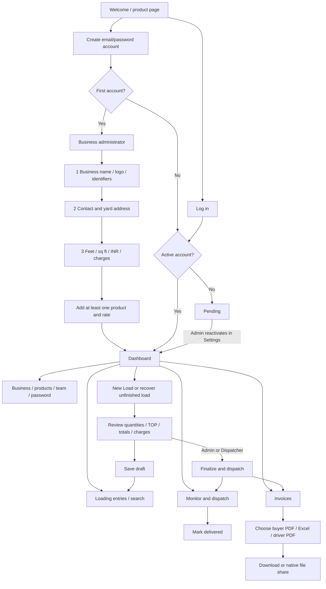

# StoneDesk: journey, screens and delivery boundaries

## Information architecture and user journey

One business serves all approved staff. There is one current account, with logout/login to switch people; there is no multiple-business switcher. Account roles come from the server, never an editable self-assigned onboarding value.

## Landing page specification

Mobile reading order:

1. Compact header: StoneDesk identity, language toggle and Log in. For signed-in people, the action opens the workspace.
2. Hero: “Every load. Accounted for.” A short yard-to-bill explanation, full-width Get Started, and a one-business/team/language note.
3. Example ledger card: clearly marked EXAMPLE LOAD, showing `3 × 2 ft`, 19 pieces and 114 sq ft. This is a calculation illustration, not a live customer metric.
4. Three vertical feature sections: Log the load; Keep dispatch moving; Finish with a clear bill. Each uses a consistent outline icon and a short explanation.
5. Record-integrity panel: account approval and locked finalized values, followed by Sign Up.
6. Footer: Privacy, pilot Terms and Contact open readable information dialogs. No invented contact address or certification. Public legal terms and support details require owner-supplied text before public launch.

The requested social-proof area is intentionally not populated with fabricated testimonials or usage numbers. Add an approved customer quote and a measured statistic when those exist.

## Authentication and setup

### Sign-up / login modal

- Native dialog; title, explanation, name on signup, email, password, show-password checkbox, primary submit, mode switch and Close.
- Minimum 12-character password; support paste and password managers. Password values are not stored in browser localStorage.
- Email/password works locally. Google and Phone OTP are unavailable until a provider is connected, following the user's decision to start locally. No email verification or email reset service is implied.
- First account becomes owner/Admin. Further accounts start active as Dispatchers. Administrators can pause access or change roles; paused users cannot read business records.
- Expired sessions return to login. The existing load recovery copy stays on the device.

### Profile wizard

| Step | Fields / content | Main action |
| --- | --- | --- |
| Business | Required name; optional GST number, trade license, JPEG/PNG logo up to 2MB | Continue |
| Contact | Optional yard/office address and primary phone; signed-in email | Continue |
| Defaults | Feet/sq ft and INR; administrator role; default loading/royalty charge | Save and continue |
| Catalogue | Product name, finish, rate per sq ft; saved product list | Open workspace after at least one product |

Previous step preserves input. Editing the profile uses the same wizard. GST is an optional business identifier; the app does not calculate tax. Weight/metric-ton entry requires a separate measurement and pricing model and is not offered as a cosmetic unit switch.

## Workspace and navigation

The header stays structurally consistent across pages. A mobile drawer contains Dashboard, Loading entries, Monitor & dispatch, Invoices and Settings. A four-item bottom bar supports frequent daily navigation. The profile area identifies the current person and role; switching people uses logout/login.

Search matches lorry number, party name, destination and full bill ID. Submit moves to Loading entries. Hash routes support browser Back and reopening a bill URL. Notifications show a count of drafts requiring review; no fabricated push notifications or unread badge.

### Dashboard

1. Screen title and operational context.
2. Prominent New Load action.
3. Recovery card when an unfinished phone draft exists, with Continue.
4. Two real counts: drafts to review and dispatched lorries in transit.
5. Total billed across saved finalized records, labeled all time. This is billed material value, not collected revenue.
6. Most recent five loads; View all loads if more exist.

### Loading entries

Search plus status filters and load cards. Each card shows lorry, party, date, area, net amount and a textual status. Draft opens a review page with Continue this draft; finalized loads open the invoice page.

### Monitor & dispatch

Read saved records on entry, on Refresh, and every 30 seconds while visible. This is polling, not GPS tracking or a live telemetry feed. Errors remain visible and keep the last successful data with its update time.

| UI concept | Persisted meaning |
| --- | --- |
| Draft | Editable Dispatch record |
| Loaded | Draft that already contains measurement groups; a derived readiness label |
| Dispatched / in transit | Finalized record, financial content locked |
| Billed | Invoice view of a finalized record, not a separate payment state |
| Completed | Delivered record |

Admin and Dispatcher can finalize/dispatch, then mark delivered. Yard Manager prepares and saves drafts. Delivery changes only transport status, not bill values.

### Invoices and exports

Finalized records only. View original business snapshot and detailed measurements, then totals. A document selector offers Buyer PDF, Buyer Excel (.xlsx), and Driver PDF without prices. One Share action and one Download/Export action avoid a wall of export buttons. The generator rereads the saved record from the server before exporting.

Native sharing lets the user select WhatsApp/email when supported; downloads are the fallback. There is no public bill-link service or automatic email sender. No messages are sent automatically.

### Settings and roles

| Action | Admin | Yard Manager | Dispatcher |
| --- | --- | --- | --- |
| Read business records and export finalized bills | Yes | Yes | Yes |
| Create/edit drafts and loading requirements | Yes | Yes | Yes |
| Finalize/dispatch and mark delivered | Yes | No | Yes |
| Change business/catalogue/default charges | Yes | No | No |
| Approve staff and assign roles | Yes | No | No |
| Change own password / logout | Yes | Yes | Yes |

The owner account cannot be disabled or demoted through staff management. Users cannot alter their own role. Denials are enforced at the API, not just by hiding buttons.

## Reference PDF specification

Use the first attached image as the canonical layout. The second image duplicates measurements across two sections; one four-column ledger is clearer and uses less paper.

- A4 portrait with white paper, business logo if supplied, muted red business wordmark, address/phone and a fine green rule.
- Party, lorry number and date, with compact bill ID, destination and supervisor metadata.
- Four columns: Group; Description / dimensions (ft × ft); No. of pcs.; Total area (sq ft).
- Numbered product/finish groups, Regular rows followed by a TOP block. Each block has quantity and area subtotals; dimensions and quarter/half areas use readable fractions.
- Final running area with total pieces, followed by a right-aligned boxed amount section. Single-rate bills can show area × rate; mixed-rate bills list the stored group amounts. Stored row-rounding takes priority over multiplying the display total.
- Repeat column headings across pages; use page numbers and continuation identity. Keep rows intact. Optional logos and long names must not overlap content.
- Driver copy uses the same layout and never reads rates or amounts. Financial Excel cells stay numeric.

The screenshots guide layout, not arithmetic. The server's stored quantities, areas, amounts and branding are authoritative, including rounding. Finalized bills are never recalculated from current catalogue prices.

## Acceptance checks

- First owner signup, login/logout, reload session; later account pending, approval, each role restriction, session expiry, password change revocation and rejected external origin.
- Setup wizard back/forward, optional identifiers, failed upload/save, products and rate overrides.
- Dashboard counts, search by truck/party/ID, browser Back, invoice deep link, monitor refresh and delivered action.
- Language toggle, 320px/390px widths, portrait/landscape, keyboard dialog dismissal, labels, focus and no horizontal overflow.
- Quantity example, fractions, TOP, mixed rates, charges, stored rounding, legacy bills, missing/long branding, multipage PDF and numeric Excel.

See DESIGN.md for tokens and component states, and PILOT.md for deployment and operational limits.
